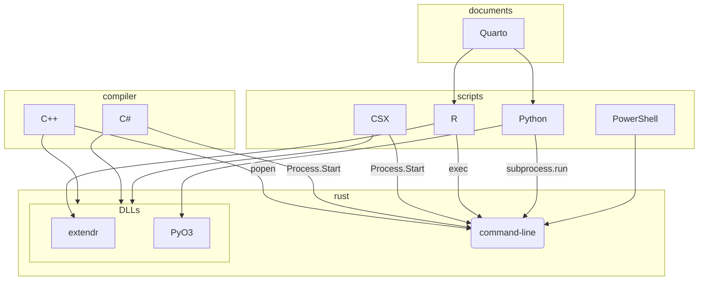

# boilerplate

boilerplate for Rust FFI bindings

- command-line utilities
- C++, C# (DLL)
- python
- R

## Description 



## Usage

### command-line

```ps1
# install from github
ps> cargo install --git https://github.com/haitusense/boilerplate [tool name]
ps> cargo install --list

# install from github (multiple packages with binaries)
ps> cargo install --git https://github.com/haitusense/boilerplate [tool name]

# install from local
ps> cargo install --path ./rust

# uninstall
ps> cargo uninstall [tool name]

# run
ps> boilerplate --help
```

### R

```r
# install from github
> remotes::install_github("haitusense/boilerplate/R")
> remotes::install_github("haitusense/boilerplate/R@dev20230310", force=T)

# install from local
> install.packages(paste(getwd(), "/R", sep = ""), repos = NULL, type = "source", configure.args = "--from-local=TRUE")
> install.packages("./R", repos = NULL, type = "source")

# uninstall
> remove.packages("boilerplate")
```

```r
# run
boilerplateR::hello_world()
```

### python

```ps1
# environment setup
ps> winget install --id Python.Python.3.12
ps> winget install --id Git.Git
ps> py -0p
ps> pip install --upgrade pip

# maturin setup
ps> pip install maturin

# local maturin project create and build
ps> maturin init
ps> maturin build -i python3.12 --release
ps> pip install .   

# install from github
ps> pip install 'git+https://github.com/haitusense/boilerplate.git#egg=boilerplatePy&subdirectory=python'
ps> pip install 'git+https://github.com/haitusense/boilerplate.git#egg=boilerplatePyo&subdirectory=pyo3'
ps> pip list

# install from local
ps> pip install ./python

# uninstall from github
ps> pip uninstall boilerplatePy
ps> pip uninstall boilerplatePyo
```

```python
# run
# ps> py -3.12 test.py
import boilerplatePy
import boilerplatePyo
boilerplatePy.hello_world()
boilerplatePyo.hello_world()
```

### c#

```ps1
# run C# script
ps> dotnet script https://raw.githubusercontent.com/haitusense/boilerplate/main/csx/main.csx
``` 


```ps1
# environment setup
ps> dotnet new -l
ps> dotnet new wpf -o boilerplateCs

# manual install
ps> cd [any folder]
ps> git clone https://github.com/haitusense/boilerplate.git
ps> dotnet publish ./boilerplate/cs -c Release -O ./
ps> rm -Force -R ./boilerplate

# manual install using tool
ps> cargo run --bin boilerplate-install

# install using tool
ps> ht-install https://github.com/haitusense/boilerplate.git -s "./cs" -o "./"
```